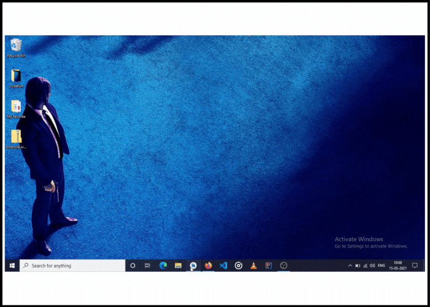

# Contribution Guidelines

1. First import all android live templates.
2. If you add new group then don't forget to add "Live" before your group name. (E.x.: LiveYourGroupName)
3. Write proper name and description.
4. Use [Live template variables](https://www.jetbrains.com/help/idea/template-variables.html).
5. Then export all live templates. [Watch below video]
6.  </img>
7. Add it in repository.
8. Last, Change README.md file according to your changes.
9. Thank you.
